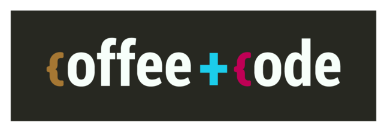

# UK Hydrographic Office

**The aim of the Coffee & Code meetups is to nurture, enable and encourage a vibrant, supportive and inclusive coding community at UKHO. Coffee & Code provides a regular opportunity for people within UKHO who are interested in coding to share skills and knowledge, provide advice and guidance to each other and generally network and get to know each other.**

This aim aligns the UK Hydrographic Office's Coffee and Code event with all UK Government Coffee and Coding events [HERE](https://docs.google.com/spreadsheets/d/13HstI9VZViUr3jxTQPMMK-gctkVeyig-7HDhN4fU1_E/edit#gid=0)

The UK Hydrographic Office run a weekly Coffee and Code event every Wednesday between 9-10am as a Teams meeting. We provide code surgery, discovery/workshop sessions as an opportunity for people to pose and share any coding related queries/ruminations/ideas to the gathered coding community. The invite for the meeting can be downloaded from https://ukho.sharepoint.com/sites/digitalhydro .

See the Awesome list below for resources, data links, project ideas, and code examples. 

If a link is broken please update the icon or add an issue so the link can be amended. 
You can also add new links or issues if you would like to share a resource with the community.
And share your ideas for Coffee and Code in the issues section!

Thanks!

* :blush: I am well.
* :pensive: Please fix me.

**Table of Contents**
* [Awesome](#awesome)
* [Coding](#coding)
* [Courses - Python Beginner](#courses---python-beginner)
* [Courses - Python Intermediate](#courses---python-intermediate)
* [Data](#data)
* [Git and GitHub](#git-and-github)
* [Image Processing](#image-processing)
* [Math](#math)
* [JavaScript](#javascript)
* [Remote Sensing](#remote-sensing)
* [UK Gov Sites](#uk-gov-sites)

# Awesome
-------------
* :blush: [Awesome lists about all kinds of interesting topics ](https://github.com/sindresorhus/awesome) - a list of lists; GitHub collaboration of awesome lists. 

# Coding - Learn and Challenge Yourself
-------------
* :blush: [Codewars](https://www.codewars.com/) - exercises in many programming languages. Submit a working solution and level up! Join the UKHO clan to be part of the UKHO leaderboard
* :blush: [JetBrains Academy](https://www.jetbrains.com/academy/) - learn to program by creating working applications. This is a paid for service but there is a free trial and the "beta" tracks are also free.
* :blush: [Google Colab](https://colab.research.google.com/notebooks/intro.ipynb) - Allows you to write and execute Python in your browser.
* :blush: [Exercism](https://exercism.io/) - Access code practice and mentorship for free in 52 different languages.
* :blush: [Advent of Code](https://adventofcode.com/) - Challenge yourself to 25 days of coding puzzles. You can go back to any of the six years and try them out - no need to wait until December!
* :blush: [CodeKata](http://codekata.com/) - Short coding challenges to improve your skills.
* :blush: [Python Playground](https://www.katacoda.com/courses/python/playground) - Allows you to write and execute Python in your browser.
* :blush: [RealPython](https://realpython.com/) - Tutorial, courses, quizzes and many more learning tools to help imporve your Python.
* :blush: [CodeGolf](https://codegolf.stackexchange.com/) - For the more advanced, try these coding competitions.

# Courses - Python Beginner
-------------

* :blush: [Coursera Learn to Program: The Fundamentals ](https://www.coursera.org/learn/learn-to-program) - free 7 week course, flexible deadlines,approx 4-8 hours/wk. Data Science strongly recommend this course and on completion you will recieve an O'Reilly Python Pocket Reference Book as a congratulations! 
* :blush: [DataCamp Introduction to Python, interactive course ](https://www.datacamp.com/courses/intro-to-python-for-data-science) - an nice easily intro to Python in-browser (so no software required).
* :blush: [Awesome Learn Data Science Resources ](https://github.com/siboehm/awesome-learn-datascience#readme) - from Awesome: a list of data science resources in Python. 
* :blush: [One document to learn numerics, science, and data with Python](http://scipy-lectures.org/) - Python for science

# Courses - Python Intermediate
--------------

* :blush: [Coursera Learn to Program: Crafting Quality Code ](https://www.coursera.org/learn/program-code) - free 5 week course, flexible deadlines, approx 6 hours/wk. 
* :blush: [Kaggle Learn ](https://www.kaggle.com/learn/overview) - Try Pandas if you want some coding techniques for work with tabular(spreadsheets) data. 
* :blush: [Fastai recommened Python learning resource ](https://forums.fast.ai/t/recommended-python-learning-resources/26888)

# Data
------------

* :blush: [Awesome Public Datasets ](https://github.com/awesomedata/awesome-public-datasets)

# Git and GitHub
---------------
* :blush: [GitHub guides ](https://guides.github.com/) - Try the 'hello world' guide to get started.
* :blush: [Learn Git Branching](https://learngitbranching.js.org/) - awesome interactive Git exercises

# Image Processing
-----------------
* :blush: [Scikit-image and Scipy image procesing](https://www.youtube.com/watch?v=pZATswy_IsQ) - introducing convolution, filtering, segmentation to imagery. The GitHub repo is [here](https://github.com/scikit-image/skimage-tutorials)

# Math
------------
* :blush: [Project Euler ](https://projecteuler.net/) - a series of challenging mathematical/computer programming problems
* :blush: [Khan Academy ](https://www.khanacademy.org/) - offers practice exercises, instructional videos, and a personalized learning dashboard on math, computer programming and more. 

# JavaScript
------------
* :blush: [Our JavaScript Guide ](javascript-guide.md/) - a Javascript guide made and maintained by us.

# Remote Sensing
------------

* :blush: [Google Earth Engine ](https://earthengine.google.com/) - Python and JavaScript API for Earth science data and analysis.

# Testing
------------
* :blush: [Test Automation University](https://testautomationu.applitools.com/) - Free courses on testing in many different languages. Also has introductory courses on some programming languages

# Cheat Sheets
* :blush: [Jupyter Notebooks](https://www.edureka.co/blog/wp-content/uploads/2018/10/Jupyter_Notebook_CheatSheet_Edureka.pdf) 

# UK Gov sites
------------

* :blush: [ONS Open Geography Portal ](https://geoportal.statistics.gov.uk/) - provides free and open access to the definitive source of geographic products, web applications, story maps, services and APIs. All content is available under the Open Government Licence v3.0.

